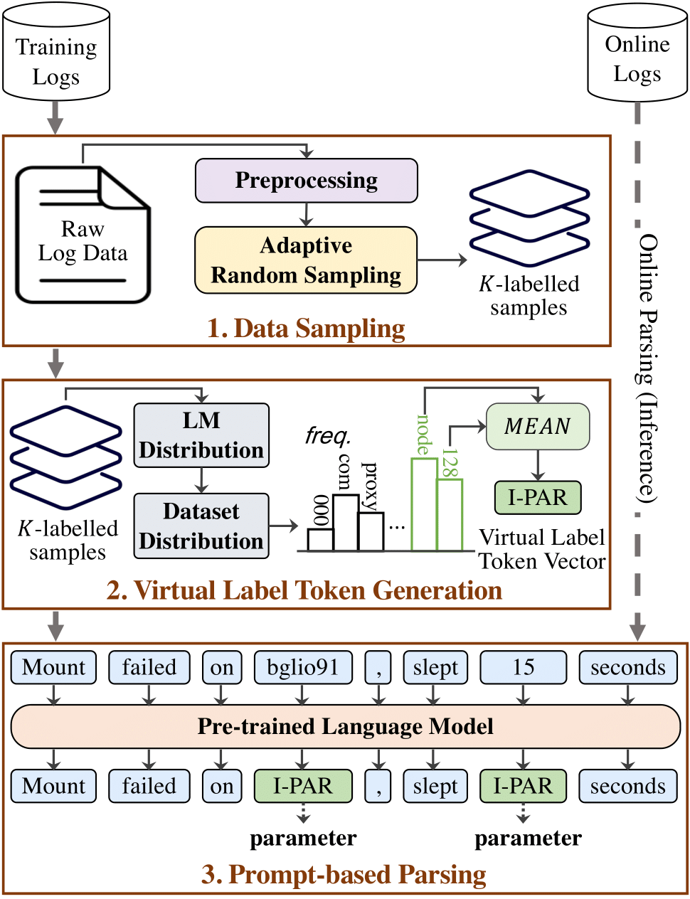

# LogPPT

Repository for the paper: Log Parsing with Prompt-based Few-shot Learning

**Abstract:** Logs generated by large-scale software systems provide crucial information for engineers to understand the
system status and diagnose problems of the systems. Log parsing, which converts raw log messages into structured data,
is the first step to enabling automated log analytics. Existing log parsers extract the common part as log templates
using statistical features. However, these log parsers often fail to identify the correct templates and parameters
because: 1) they often overlook the semantic meaning of log messages, and 2) they require domain-specific knowledge for
different log datasets. To address the limitations of existing methods, in this paper, we propose LogPPT to capture the
patterns of templates using prompt-based few-shot learning. LogPPT utilises a novel prompt tuning method to recognise
keywords and parameters based on a few labelled log data. In addition, an adaptive random sampling algorithm is designed
to select a small yet diverse training set. We have conducted extensive experiments on 16 public log datasets. The
experimental results show that LogPPT is effective and efficient for log parsing.

## I. Framework

<p align="center"><br>An overview of LogPPT</p>

LogPPT consists of the following components:
1. **Adaptive Random Sampling algorithm**:  A few-shot data sampling algorithm, which is used to select K labelled logs for training (K is small).
2. **Few-shot Data Sampling**: An adaptive random sampling based method for selecting K labelled logs for training (K is small).
3. **Prompt-based Parsing**: A module to tune a pre-trained language model using prompt tuning for log parsing

## II. Requirements
### 2.1. Library
1. Python 3.8
2. torch
3. transformers
4. ...

To install all library:
```shell
$ pip install -r requirements.txt
```

### 2.2. Pre-trained models
To download the pre-trained language model:
```shell
$ cd pretrained_models/roberta-base
$ bash download.sh
```

## III. Usage:

### 3.1. Few-shot data Sampling

```shell
$ python fewshot-sampling.py
```

### 3.2. Training & Parsing
```shell
dataset=Apache
shot=32
trf="datasets/${dataset}/${shot}shot/1.json"
tef="datasets/${dataset}/test.json"
python train.py --mode prompt-tuning --train_file ${trf} \
    --validation_file ${tef} \
    --model_name_or_path "./pretrained_models/roberta-base" \
    --per_device_train_batch_size 8 \
    --learning_rate 5e-5 \
    --lr_scheduler_type polynomial \
    --task_name log-parsing \
    --num_warmup_steps 20 \
    --max_train_steps 200 \
    --log_file datasets/${dataset}/${dataset}_2k.log_structured.csv \
    --shot $shot \
    --dataset_name ${dataset} \
    --task_output_dir "outputs"
```
The parsed logs (parsing results) are saved in the `outputs` folder.

For the descriptions of all parameters, please use:
```shell
python train.py --help
```

### 3.3. Evaluation

```shell
python benchmark.py
```

## IV. Results
### 4.1. Baselines
| Tools  | References                                                                                                                                                                                                                                                                                                                                                                                                                                                                                                                                  |
|:-------|:--------------------------------------------------------------------------------------------------------------------------------------------------------------------------------------------------------------------------------------------------------------------------------------------------------------------------------------------------------------------------------------------------------------------------------------------------------------------------------------------------------------------------------------------|
| AEL    | [**QSIC'08**] [Abstracting Execution Logs to Execution Events for Enterprise Applications](https://www.researchgate.net/publication/4366728_Abstracting_Execution_Logs_to_Execution_Events_for_Enterprise_Applications_Short_Paper), by Zhen Ming Jiang, Ahmed E. Hassan, Parminder Flora, Gilbert Hamann. <br> [**JSME'08**] [An Automated Approach for Abstracting Execution Logs to Execution Events](http://www.cse.yorku.ca/~zmjiang/publications/jsme2008.pdf), by Zhen Ming Jiang, Ahmed E. Hassan, Gilbert Hamann, Parminder Flora. |
| LenMa  | [**CNSM'15**] [Length Matters: Clustering System Log Messages using Length of Words](https://arxiv.org/pdf/1611.03213.pdf), by Keiichi Shima.                                                                                                                                                                                                                                                                                                                                                                                               |
| Spell  | [**ICDM'16**] [Spell: Streaming Parsing of System Event Logs](https://www.cs.utah.edu/~lifeifei/papers/spell.pdf), by Min Du, Feifei Li.                                                                                                                                                                                                                                                                                                                                                                                                    |
| Drain  | [**ICWS'17**] [Drain: An Online Log Parsing Approach with Fixed Depth Tree](https://jiemingzhu.github.io/pub/pjhe_icws2017.pdf), by Pinjia He, Jieming Zhu, Zibin Zheng, and Michael R. Lyu.                                                                                                                                                                                                                                                                                                                                                |
| Logram | [**TSE'20**] [Logram: Efficient Log Parsing Using nn-Gram Dictionaries](https://arxiv.org/pdf/2001.03038.pdf), by Hetong Dai, Heng Li, Che-Shao Chen, Weiyi Shang, and Tse-Hsun Chen.                                                                                                                                                                                                                                                                                                                                                       |

** Implementations for baselines are adopted from [Tools and Benchmarks for Automated Log Parsing](https://doi.org/10.1109/ICSE-SEIP.2019.00021), and [Guidelines for Assessing the Accuracy of Log Message Template Identification Techniques](https://doi.org/10.1145/3510003.3510101).

### 4.2. RQ1: Parsing Effectiveness
- Accuracy:
<p align="center"></p>

- Robustness:
<p align="center"><br>Robustness across different log data types</p>
<p align="center"><br>Robustness across different numbers of training data</p>

- Accuracy on Unseen Logs:
<p align="center"><br>Accuracy on Unseen Logs</p>

### 4.3. RQ2: Runtime Performance Evaluation
<p align="center"><br>Running time of different log parsers under different volume</p>

### 4.4. RQ3: Ablation Study
- We exclude the Virtual Label Token Generation module and let the pre-trained model automatically assign the embedding for the virtual label token “I-PAR”. To measure the contribution of the Adaptive Random Sampling module, we remove it from our model and randomly sample the log messages for labelling.
<p align="center"><br>Ablation Study Results</p>

- We vary the number of label words from 1 to 16 used in the Virtual Label Token Generation module.
<p align="center"><br>Results with different numbers of label words</p>

### 4.5. RQ4: Comparison with Different Tuning Techniques
We compare LogPPT with fine-tuning, hard-prompt, and soft-prompt.

- Effectiveness:
<p align="center"><br>Accuracy across different tuning methods</p>

- Efficiency:
<p align="center"><br>Parsing time across different tuning methods</p>

### Additional results with [PTA and RTA](https://doi.org/10.1145/3510003.3510101) metrics

- PTA: The ratio of correctly identified templates over the total number of identified templates.

- RTA: The ratio of correctly identified templates over the total number of oracle templates.
<p align="center"></p>

### Parsing results with [Build Log](logs/BuildLog/example.log) from [LogChunks](https://zenodo.org/record/3632351)

| Raw logs                                                                                                                                         | Events                                                                                    |
|:-------------------------------------------------------------------------------------------------------------------------------------------------|:------------------------------------------------------------------------------------------|
| TEST 9/13884 \[2/2 concurrent test workers running\]                                                                                             | TEST <\*> \[<\*> concurrent test workers running\]                                        |
| (1.039 s) Test touch() function : basic functionality \[ext/standard/tests/file/touch_basic.phpt\]                                               | <\*> Test touch() function : basic functionality <*>                                      |
| (120.099 s) Bug #60120 (proc_open hangs when data in stdin/out/err is getting larger or equal to 2048) \[ext/standard/tests/file/bug60120.phpt\] | <\*> Bug <\*> (proc_open hangs when data in <\*> is getting larger or equal to <\*>) <\*> |
| SKIP Bug #54977 UTF-8 files and folder are not shown \[ext/standard/tests/file/windows_mb_path/bug54977.phpt\] reason: windows only test         | SKIP Bug <\*> UTF-8 files and folder are not shown <\*> reason: windows only test         |
| Exts skipped    :   17                                                                                                                           | Exts skipped : <*>                                                                        |

[Full results with 32shot](outputs/32shot/BuildLog_2k.log_structured.csv)