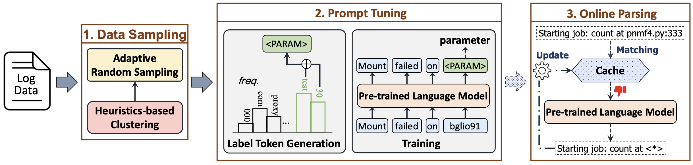
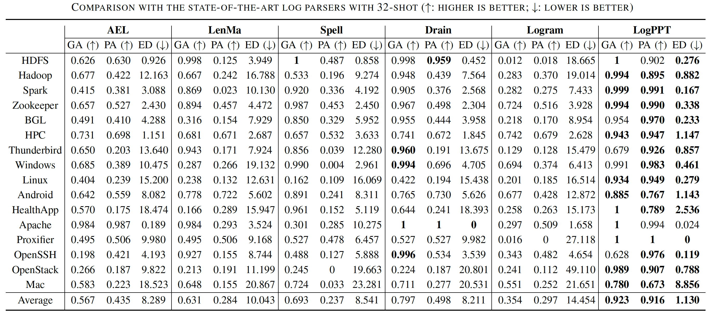
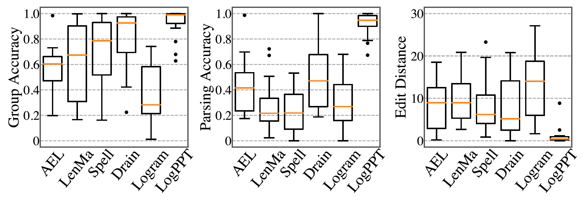
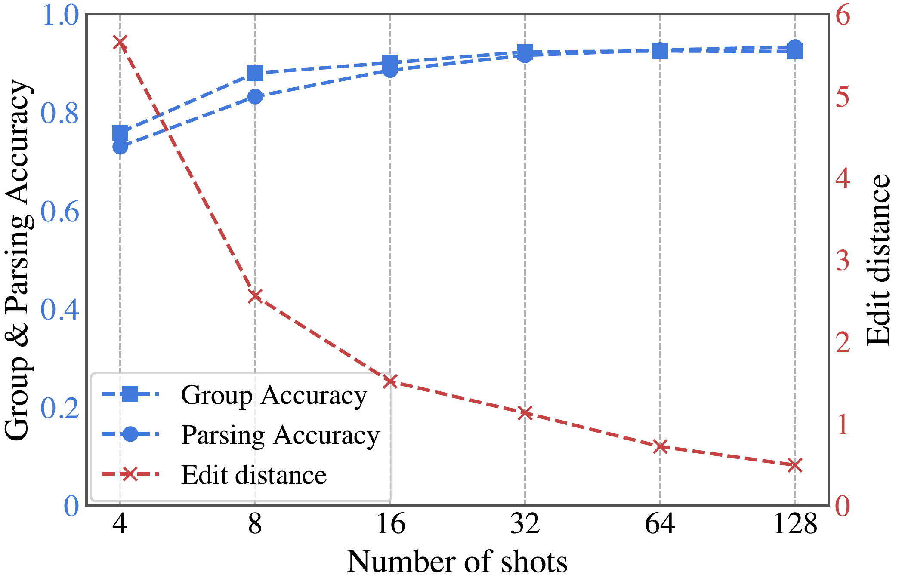
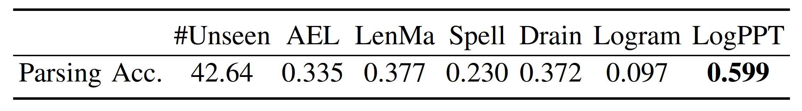
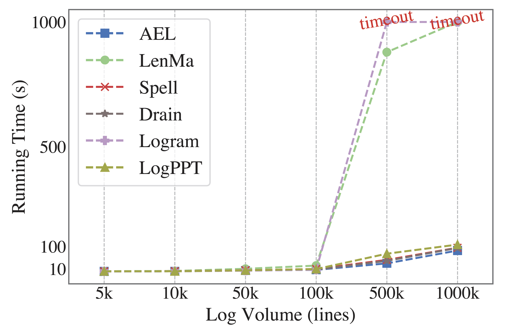
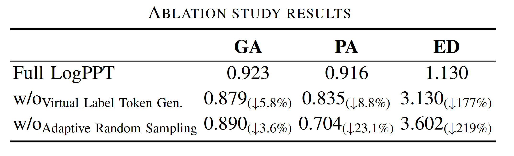
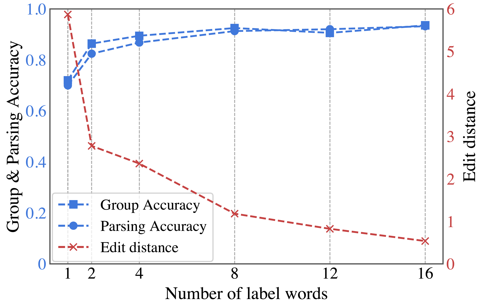
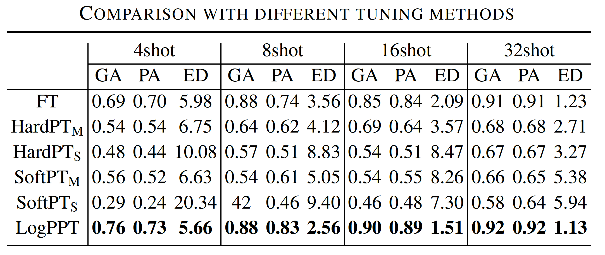
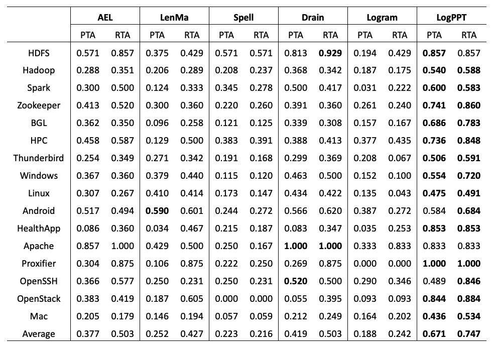

# LogPPT 2.0: Effective and Efficient Log Parsing with Prompt-based Few-shot Learning


## I. Framework

<p align="center"><br>An overview of LogPPT</p>

LogPPT consists of the following components:
1. **Data Sampling**:  A few-shot data sampling algorithm, which is used to select $K$ labelled logs for training ($K$ is small).
2. **Prompt-based Parsing**: A module to tune a pre-trained language model using prompt tuning for log parsing
3. **Online Parsing**: A caching mechanism to support efficient and consistent online parsing.

## II. Requirements
1. Python >=3.9
2. torch
3. transformers
4. ...

To install all library:
```shell
$ pip install -r requirements.txt
```

### 2.2. Pre-trained models
To download the pre-trained language model:
```shell
$ cd pretrained_models/roberta-base
$ bash download.sh
```

## III. Usage:

### 3.1. Few-shot data Sampling

```shell
$ cd demo
$ python 01_sampling.py
```

### 3.2. Training & Parsing
```shell
$ cd demo
$ export dataset=Apache
$ python 02_run_logppt.py --log_file ../datasets/loghub-full/$dataset/${dataset}_full.log_structured.csv --model_name_or_path roberta-base --train_file ../datasets/loghub-full/$dataset/samples/logppt_32.json --validation_file ../datasets/loghub-full/$dataset/validation.json --dataset_name $dataset --parsing_num_processes 4 --output_dir ./results/models/$dataset --task_output_dir ./results/logs --max_train_steps 1000
```
The parsed logs (parsing results) are saved in the `outputs` folder.

For the descriptions of all parameters, please use:
```shell
python 02_run_logppt.py --help
```

### 3.3. Evaluation

```shell
python 03_evaluate.py
```
<!-- <details>
## IV. Results
### 4.1. Baselines
| Tools  | References                                                                                                                                                                                                                                                                                                                                                                                                                                                                                                                                  |
|:-------|:--------------------------------------------------------------------------------------------------------------------------------------------------------------------------------------------------------------------------------------------------------------------------------------------------------------------------------------------------------------------------------------------------------------------------------------------------------------------------------------------------------------------------------------------|
| AEL    | [**QSIC'08**] [Abstracting Execution Logs to Execution Events for Enterprise Applications](https://www.researchgate.net/publication/4366728_Abstracting_Execution_Logs_to_Execution_Events_for_Enterprise_Applications_Short_Paper), by Zhen Ming Jiang, Ahmed E. Hassan, Parminder Flora, Gilbert Hamann. <br> [**JSME'08**] [An Automated Approach for Abstracting Execution Logs to Execution Events](http://www.cse.yorku.ca/~zmjiang/publications/jsme2008.pdf), by Zhen Ming Jiang, Ahmed E. Hassan, Gilbert Hamann, Parminder Flora. |
| LenMa  | [**CNSM'15**] [Length Matters: Clustering System Log Messages using Length of Words](https://arxiv.org/pdf/1611.03213.pdf), by Keiichi Shima.                                                                                                                                                                                                                                                                                                                                                                                               |
| Spell  | [**ICDM'16**] [Spell: Streaming Parsing of System Event Logs](https://www.cs.utah.edu/~lifeifei/papers/spell.pdf), by Min Du, Feifei Li.                                                                                                                                                                                                                                                                                                                                                                                                    |
| Drain  | [**ICWS'17**] [Drain: An Online Log Parsing Approach with Fixed Depth Tree](https://jiemingzhu.github.io/pub/pjhe_icws2017.pdf), by Pinjia He, Jieming Zhu, Zibin Zheng, and Michael R. Lyu.                                                                                                                                                                                                                                                                                                                                                |
| Logram | [**TSE'20**] [Logram: Efficient Log Parsing Using nn-Gram Dictionaries](https://arxiv.org/pdf/2001.03038.pdf), by Hetong Dai, Heng Li, Che-Shao Chen, Weiyi Shang, and Tse-Hsun Chen.                                                                                                                                                                                                                                                                                                                                                       | -->

** Implementations for baselines are adopted from [Tools and Benchmarks for Automated Log Parsing](https://doi.org/10.1109/ICSE-SEIP.2019.00021), and [Guidelines for Assessing the Accuracy of Log Message Template Identification Techniques](https://doi.org/10.1145/3510003.3510101).

### 4.2. RQ1: Parsing Effectiveness
- Accuracy:
<p align="center"></p>

- Robustness:
<p align="center"><br>Robustness across different log data types</p>
<p align="center"><br>Robustness across different numbers of training data</p>

- Accuracy on Unseen Logs:
<p align="center"><br>Accuracy on Unseen Logs</p>

### 4.3. RQ2: Runtime Performance Evaluation
<p align="center"><br>Running time of different log parsers under different volume</p>

### 4.4. RQ3: Ablation Study
- We exclude the Virtual Label Token Generation module and let the pre-trained model automatically assign the embedding for the virtual label token “I-PAR”. To measure the contribution of the Adaptive Random Sampling module, we remove it from our model and randomly sample the log messages for labelling.
<p align="center"><br>Ablation Study Results</p>

- We vary the number of label words from 1 to 16 used in the Virtual Label Token Generation module.
<p align="center"><br>Results with different numbers of label words</p>

### 4.5. RQ4: Comparison with Different Tuning Techniques
We compare LogPPT with fine-tuning, hard-prompt, and soft-prompt.

- Effectiveness:
<p align="center"><br>Accuracy across different tuning methods</p>

- Efficiency:
<p align="center"><br>Parsing time across different tuning methods</p>

### Additional results with [PTA and RTA](https://doi.org/10.1145/3510003.3510101) metrics

- PTA: The ratio of correctly identified templates over the total number of identified templates.

- RTA: The ratio of correctly identified templates over the total number of oracle templates.
<p align="center"></p>

### Parsing results with [Build Log](logs/BuildLog/example.log) from [LogChunks](https://zenodo.org/record/3632351)

| Raw logs                                                                                                                                         | Events                                                                                    |
|:-------------------------------------------------------------------------------------------------------------------------------------------------|:------------------------------------------------------------------------------------------|
| TEST 9/13884 \[2/2 concurrent test workers running\]                                                                                             | TEST <\*> \[<\*> concurrent test workers running\]                                        |
| (1.039 s) Test touch() function : basic functionality \[ext/standard/tests/file/touch_basic.phpt\]                                               | <\*> Test touch() function : basic functionality <*>                                      |
| (120.099 s) Bug #60120 (proc_open hangs when data in stdin/out/err is getting larger or equal to 2048) \[ext/standard/tests/file/bug60120.phpt\] | <\*> Bug <\*> (proc_open hangs when data in <\*> is getting larger or equal to <\*>) <\*> |
| SKIP Bug #54977 UTF-8 files and folder are not shown \[ext/standard/tests/file/windows_mb_path/bug54977.phpt\] reason: windows only test         | SKIP Bug <\*> UTF-8 files and folder are not shown <\*> reason: windows only test         |
| Exts skipped    :   17                                                                                                                           | Exts skipped : <*>                                                                        |

[Full results with 32shot](outputs/32shot/BuildLog_2k.log_structured.csv)
</details>